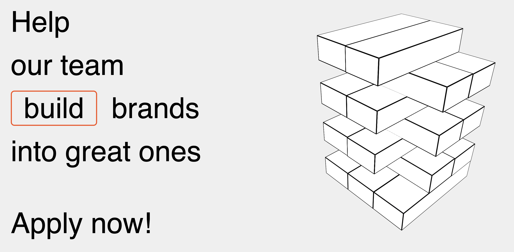
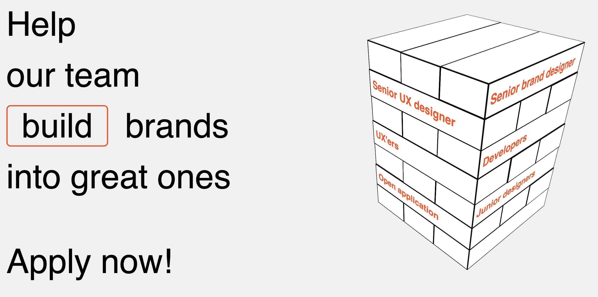
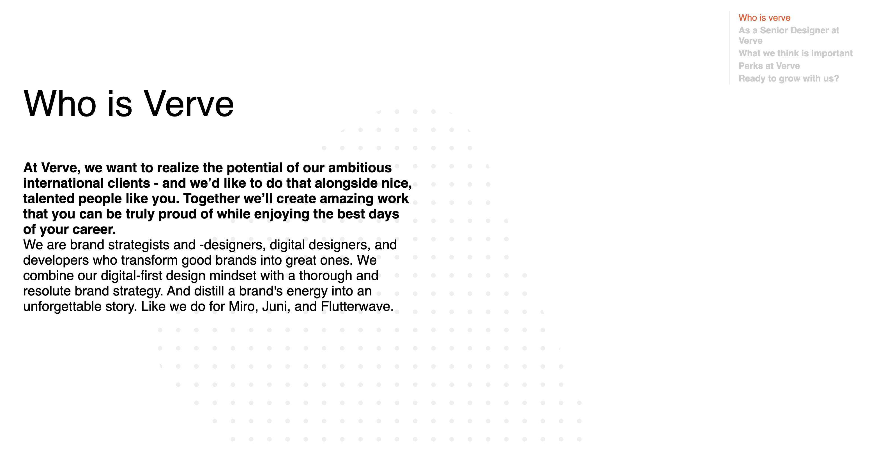

# Sprint 6: The startup-responsive-interactive-website

## Beschrijving

De opdracht voor sprint 6: The startup was het maken van een responsive website voor een opdrachtgever. De opdrachtgever
waaronder ik was ingedeeld is Verve Agency. Wij hebben zelfstandig de opdrachtgever bezocht voor een briefing. De
opdracht die mij was toegewezen was het creëeren van een interactieve pagina die potentiële designers (en developers)
nieuwsgierig en warm maakt om bij Verve te solliciteren. De pagina vormt een aanvulling op de bestaande carrierepagina
op hun website. Hij dient hetzelfde doel maar serveert andere content en op een interactieve manier. Ze zijn op hun
eigen website wat meer ingetogen en op de nieuwe pagina die wij moesten realiseren gaan we juist helemaal los.
Transities, easter eggs, skatende honden, dat de hond gaat praten bij drie muisklikken: niets is te gek. De pagina mag
uitstralen dat Verve Agency een gedreven creatief team is. Hun huidige carrierepagina is te bezoeken via de volgende
link: [Carrierepagina-Verve-Agency](https://verveagency.com/careers).

Mijn idee was een soort interface te creëren waarmee je met een klik naar de desbtreffende vacature pagina gaat. Dit heb
ik vorm gegeven via een jenga toren. Bij default zijn er een paar blokjes weg gelaten. Deze worden door een klik op de
knop geactiveerd, en vliegen dan in.

Voor animatie:

Na animatie:

Als je klikt op de link: Senior brand designer, ga je naar het volgende scherm:

Hier kan je de gehele vacature lezen en er eventueel op reageren. 

## Kenmerken

## Bronnen